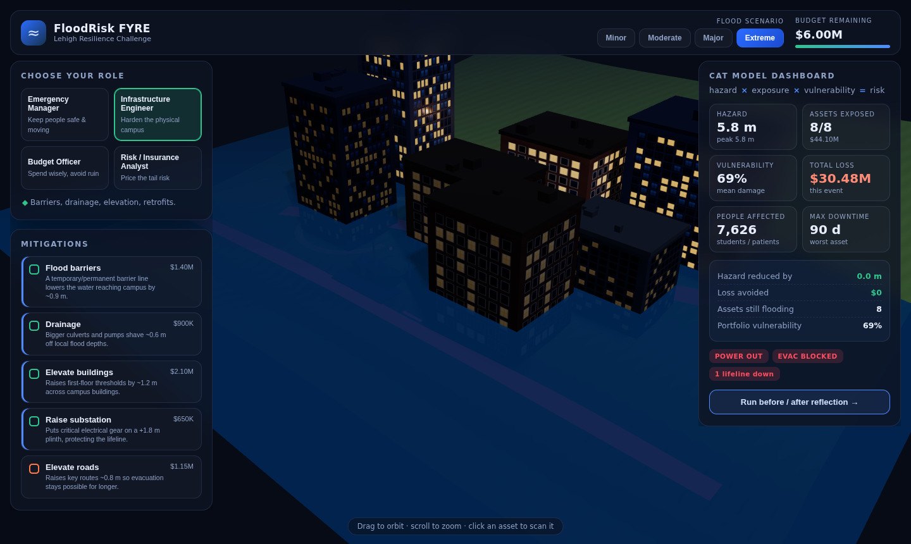
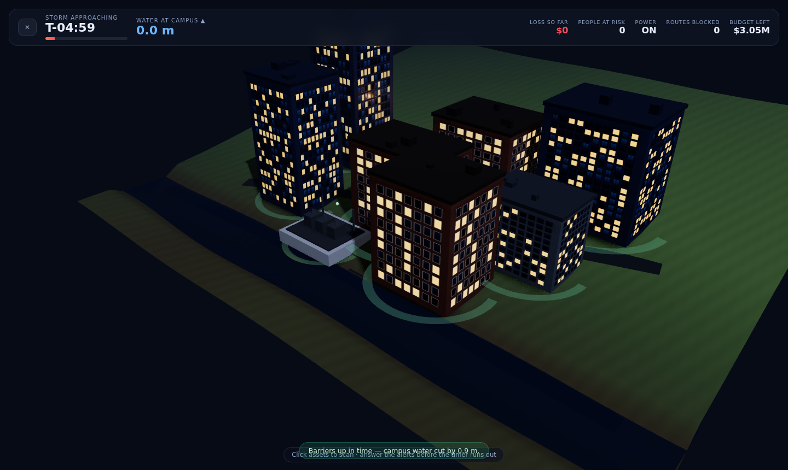
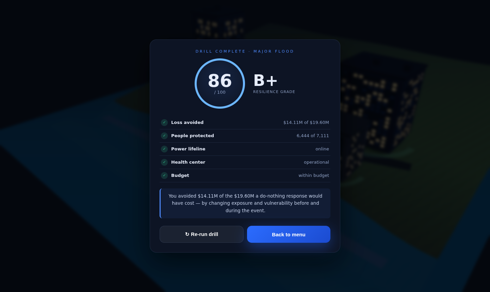
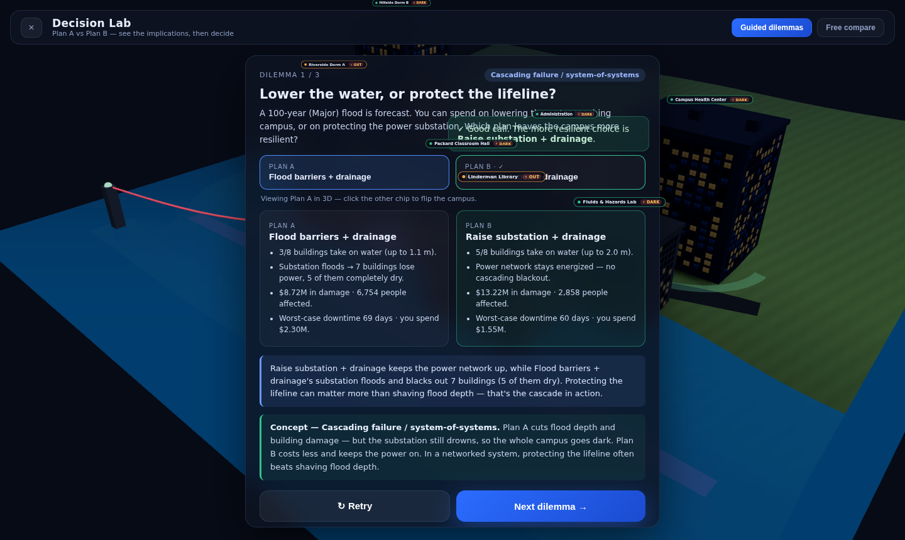
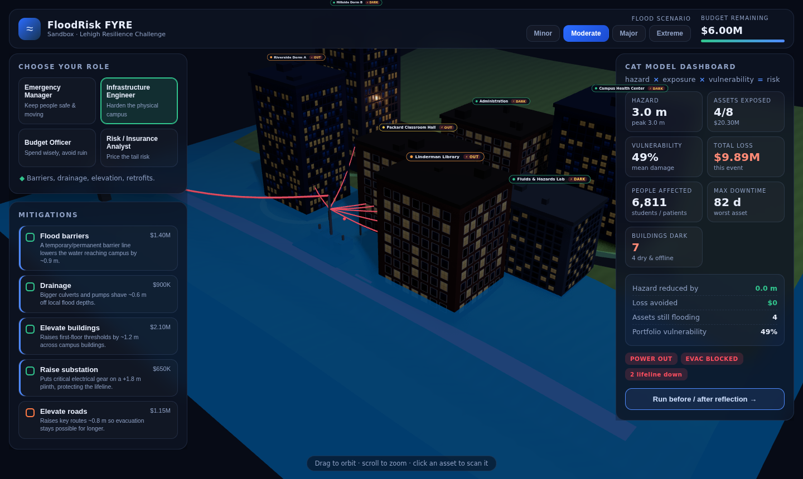

# FloodRisk FYRE — Lehigh Resilience Challenge

A small **3D classroom game** that teaches the catastrophe-model intuition:

> **hazard × exposure × vulnerability = risk**

Students drop into a stylised riverside Lehigh-like campus at night, pick a flood
scenario, and choose mitigations **before** the water rises. The 3D floodwater
animates up, buildings shift green → red as they take damage, and a CAT-model
dashboard shows loss, downtime, people affected and budget in real time. A
before/after reflection makes the key point: *the same flood can cost far less
when you change exposure and vulnerability — not the hazard.*



| Live drill (real-time decisions) | Resilience scorecard |
| --- | --- |
|  |  |

## Modes

- **⏱ Live Drill (real-time decision-maker)** — begin at Day -5 with a surprise
  storm and make emergency calls while the river rises. The clock pauses for each
  choice, and every option explains its cost, setup time, and likely effect.
  Actions such as targeted barriers, evacuation, pumps, and lifeline protection
  may take hours or days to finish; long-term construction can be started, but
  will not protect the campus during this event. Ends with a **0–100 resilience
  score and letter grade**
  broken down by loss avoided, people protected, lifelines kept online and
  budget discipline. Engine: `src/game/drill.ts`, UI: `src/Drill.tsx`.
- **⚖ Decision Lab (Plan A vs Plan B)** — teach the concepts by comparison.
  *Guided dilemmas* pose a choice (e.g. "lower the water vs. protect the
  substation"), ask the student to **predict**, then reveal both outcomes
  side-by-side with the gains and trade-offs of each. The model offers a
  context-specific recommendation rather than marking one choice right or wrong.
  *Free compare* lets students build their own two plans and see a
  side-by-side scoreboard (damage, buildings dark, people, downtime, spend, cost
  of risk) with an auto-generated recommendation and insight. Engine:
  `src/game/compare.ts`, UI: `src/Compare.tsx`.

  

- **$ Insurance Desk** — price the flood risk like an actuary. Computes each
  building's **Expected Annual Loss** (integrated over the flood loss-exceedance
  curve), then the full premium anatomy — pure / gross premium, loading,
  insured value, deductible, reinsurance, **PML** at return periods, and the
  **loss / expense / combined ratio** — under four strategies (flat,
  hazard-scaled, actuarially fair, affordability-capped). A Coverage /
  Affordability / Profitability triad scores the book 0–100. Data unlocks in
  **5 progressive levels** (Inventory → Hazard → Vulnerability/EAL →
  Affordability → Financial model). Level 5 opens the black box and traces a
  100-year event across the owner, primary insurer, and reinsurer.
  This ports the math and vocabulary of the FYRE Week-4 insurance tool
  (`insurance_pricing_tool.py`) to the flood context. Engine:
  `src/game/insurance.ts`, UI: `src/Insurance.tsx`.

- **◇ Sandbox** — no clock. Switch roles, toggle mitigations across four flood
  scenarios, scan assets, and compare before/after loss at your own pace. The
  Risk / Insurance Analyst role now surfaces portfolio EAL, the actuarially-fair
  premium and the combined ratio. A built-in walkthrough explains the workflow;
  the controls can be dragged or collapsed, and a live summary explains what each
  set of choices changed.

## Features

- **Cascading power network** — a grid intake → substation → feeder-line → building
  topology (the FloodRiskBTP "system-of-systems" mechanic). When the riverside
  substation floods, every downstream building loses power — *including dry
  buildings on high ground that never touched water* — their windows go black and
  the feeder lines turn red. Raising the substation (or lowering the water with
  barriers/drainage) keeps the network energized (cyan lines). Recovery follows
  tiered downtime: buildings ~7 / 15 / 60 days by severity, power/roads ~3 days.

  

- **Realistic procedural buildings** — brick / glass / concrete facades with lit
  windows, rooftop clutter and parapets, generated on a canvas (no downloaded
  assets). Windows go dark when a building loses power.
- **Four roles** — Emergency Manager, Infrastructure Engineer, Budget Officer and
  Risk/Insurance Analyst. Each sees the same disaster with a tailored dashboard.
- **Five mitigations** — deployable flood barriers, storm drainage, building
  elevation, substation raising and road elevation. Each changes hazard,
  vulnerability or a specific lifeline.
- **Four flood scenarios** — 10-, 50-, 100- and 500-year events.
- **Live CAT dashboard** — hazard depth, exposed assets, portfolio vulnerability,
  total loss, downtime, people affected, expected annual loss and premiums.
- **Rising 3D floodwater**, blocked evacuation routes, and a substation that
  trips offline when inundated.
- **Before/after reflection** with loss avoided and return-on-mitigation.

## Tech

- React + TypeScript + Vite
- three.js via `@react-three/fiber` and `@react-three/drei`
- All game logic is local (see `src/game/`), no backend or login required.

The numbers are **made-up-but-reasonable teaching values**, not a research-grade
model. `src/game/data.ts` (assets, costs, fragility) and `src/game/model.ts`
(the CAT formulas) are the two files to edit to swap in real Lehigh / INCORE data
later.

### Connecting to the research model (INCORE) later

This game is the **educational front end**; the research-grade catastrophe model
lives in the reference repo
[`sushreyomisra07/FloodRiskBTP`](https://github.com/sushreyomisra07/FloodRiskBTP),
which runs on [INCORE](https://tools.in-core.org) (free account required). The
intended path is to keep this fast in-browser toy model for the live demo, then
have a small backend expose INCORE/FloodRiskBTP results (or a forked toy dataset)
through the same shape the game already consumes in `src/game/`. No INCORE login
is needed to run or demo this game.

## Run locally

```bash
npm install
npm run dev      # http://127.0.0.1:5173
npm run build    # production build to dist/
npm run preview  # serve the production build
```

## Deploy

The repo is Vercel-ready (`vercel.json`, Vite framework preset). Import the repo
at [vercel.com/new](https://vercel.com/new) and deploy — no configuration needed.

[](https://vercel.com/new/clone?repository-url=https://github.com/noyo12394/flood_risk)

## Controls

Drag to orbit · scroll to zoom · click any asset to scan it.
